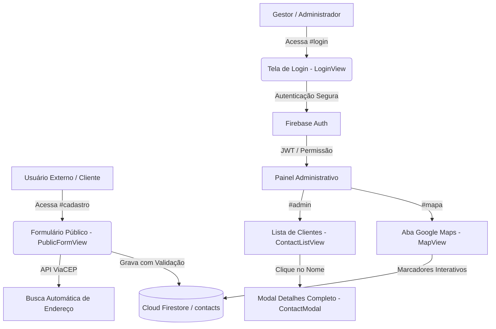

# Guia de Arquitetura & Manual Completo - CRM Clientes (Multiplataforma)

Este documento detalha a arquitetura do **CRM Clientes | Claudemar Modas**, desenvolvido como uma solução **Full-Stack Multiplataforma (Web, Android e iOS)** utilizando HTML5/Modern JavaScript (ES6+), **Vanilla CSS** com design system de alta estética, **Firebase (Auth & Cloud Firestore)** e **Google Maps Platform**.

---

## 1. Visão Geral da Arquitetura

A aplicação está dividida em **2 grandes fluxos** dentro da mesma estrutura de código, separados por roteamento e controle de permissões no Firebase:



---

## 2. Estrutura de Pastas e Arquivos do Projeto

A organização segue os princípios de separação de responsabilidades (SoC) e facilidade de compilação nativa com o **Capacitor**:

```text
Claudemar Modas/
├── .env.example                 # Exemplo de variáveis de ambiente (Firebase e Google Maps)
├── capacitor.config.json        # Configuração do Capacitor para compilação Android e iOS
├── firestore.rules              # Regras de segurança de produção do Cloud Firestore
├── index.html                   # Entry point PWA/Web App da aplicação HTML5
├── package.json                 # Dependências (Vite, Firebase, Capacitor, Google Maps)
├── src/
│   ├── config/
│   │   └── firebase.js          # Inicialização do Firebase Auth e Cloud Firestore (+ Modo Demo)
│   ├── services/
│   │   ├── authService.js       # Serviço de autenticação com e-mail/senha
│   │   └── contactService.js    # Serviço de CRUD no Firestore, CEP (ViaCEP) e Geocoding
│   ├── components/
│   │   ├── Navbar.js            # Cabeçalho/Navbar com alternância de abas e modo
│   │   ├── ContactModal.js      # Modal com detalhes completos (CPF/RG, Nascimento, etc)
│   │   └── Toast.js             # Notificações visuais elegantes do sistema
│   ├── views/
│   │   ├── LoginView.js         # Tela de Login Privada para o Gestor
│   │   ├── ContactListView.js   # Lista Resumida (Nome, Telefone e Endereço) com busca
│   │   ├── MapView.js           # Aba de Integração com Google Maps (Pinos interativos)
│   │   └── PublicFormView.js    # Formulário Externo para o cliente preencher
│   ├── styles/
│   │   └── main.css             # Design System Vanilla CSS (Glassmorphism, Temas, Mobile)
│   └── main.js                  # Router de Hash e Controlador Central de Estado
└── README.md
```

---

## 3. Segurança e Regras do Firebase (Cloud Firestore)

O arquivo `firestore.rules` foi estruturado para garantir estritamente que **apenas usuários autenticados** no painel administrativo possam ler, atualizar ou excluir clientes, permitindo que o formulário público envie novos cadastros (`create`):

```javascript
rules_version = '2';

service cloud.firestore {
  match /databases/{database}/documents {
    match /contacts/{contactId} {
      // 1. Acesso Administrativo: Ler, editar ou excluir apenas com login no Firebase Auth
      allow read, update, delete: if request.auth != null;
      
      // 2. Formulário Público Externo: Escrita permitida com validação de campos
      allow create: if request.resource.data.keys().hasAll(['fullName', 'phone', 'address', 'createdAt'])
                    && request.resource.data.fullName is string
                    && request.resource.data.fullName.size() > 2;
    }
    match /{document=**} {
      allow read, write: if false;
    }
  }
}
```

---

## 4. Diferenciais Técnicos Implementados

1. **Modo de Demonstração Híbrido (Zero Configuração):**
   - O app foi configurado para funcionar **imediatamente out-of-the-box**, mesmo antes de você conectar suas próprias chaves de API do Firebase no arquivo `.env`. Em Modo Demo, ele simula a autenticação e gerencia contatos em memória (com coordenadas reais ao redor de São Paulo).
2. **Integração ViaCEP para Máxima Experiência do Cliente:**
   - No **Formulário Público (`#cadastro`)**, ao digitar o CEP, o sistema consulta a API ViaCEP e preenche automaticamente **Rua, Bairro, Cidade e Estado**.
3. **Integração Oficial com Google Maps + Fallback OpenStreetMap:**
   - Na **Aba Google Maps (`#mapa`)**, o sistema usa a biblioteca `@googlemaps/js-api-loader` com o Google Maps Dark Mode se houver chave configurada; caso contrário, exibe um mapa interativo com marcadores nativos sem quebrar a interface.

---

## 5. Instruções Básicas para Gerar Builds Android e iOS

O projeto já está configurado com o **Capacitor**, o que permite compilar o app web como aplicativo nativo (.apk / .aab para Android e .ipa para iOS) compartilhando 100% da lógica e do visual.

### Pré-requisitos Gerais
- **Node.js** (v18+) e **npm** instalados.
- Para **Android**: [Android Studio](https://developer.android.com/studio) atualizado e Android SDK configurado.
- Para **iOS**: macOS com [Xcode](https://developer.apple.com/xcode/) e CocoaPods instalados.

---

### A. Geração de Build para Android (.apk / .aab)

1. **Instale as dependências e gere o bundle web de produção:**
   ```bash
   npm install
   npm run build
   ```
2. **Adicione a plataforma Android ao projeto:**
   ```bash
   npx cap add android
   ```
3. **Sincronize o código compilado (`/dist`) com o projeto Android:**
   ```bash
   npx cap sync android
   ```
4. **Abra o projeto no Android Studio:**
   ```bash
   npx cap open android
   ```
5. **Gerando o APK / App Bundle dentro do Android Studio:**
   - Conecte um celular Android ou abra o Emulador e clique no ícone **Run (▶)** para testar.
   - Para gerar o aplicativo para instalação ou Google Play Store:
     - No menu superior do Android Studio, clique em: **Build > Generate Signed Bundle / APK...**
     - Escolha **APK** (para distribuir diretamente) ou **Android App Bundle** (para publicar na Google Play Store).
     - Crie ou selecione seu arquivo *Keystore* de assinatura, avance e clique em **Finish**.
     - O arquivo compilado estará disponível na pasta `android/app/release/`.

---

### B. Geração de Build para iOS (.ipa / App Store)

1. **Gere o bundle de produção e adicione a plataforma iOS:**
   ```bash
   npm run build
   npx cap add ios
   npx cap sync ios
   ```
2. **Abra o projeto nativo no Xcode (macOS necessário):**
   ```bash
   npx cap open ios
   ```
3. **Configurando e Gerando o Build dentro do Xcode:**
   - Na barra lateral esquerda do Xcode, selecione o projeto **App** e vá na aba **Signing & Capabilities**.
   - Selecione o seu **Team** (conta de desenvolvedor Apple) para assinar o aplicativo.
   - Para testar localmente, selecione o seu iPhone ou um Simulador no topo e pressione **Cmd + R**.
   - Para publicar na App Store ou gerar o `.ipa`:
     - Selecione o dispositivo de destino como **Any iOS Device (arm64)**.
     - No menu superior, clique em: **Product > Archive**.
     - Ao finalizar, o **Xcode Organizer** será aberto; clique em **Distribute App** para enviar à App Store Connect ou exportar o arquivo nativo assinado.
